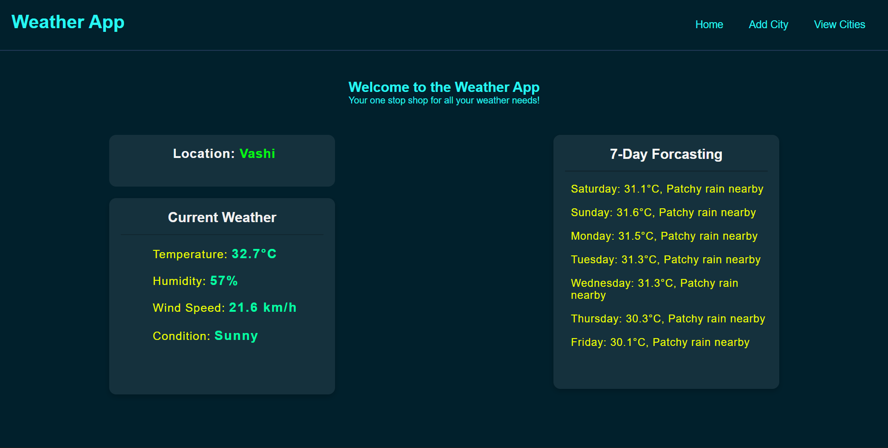
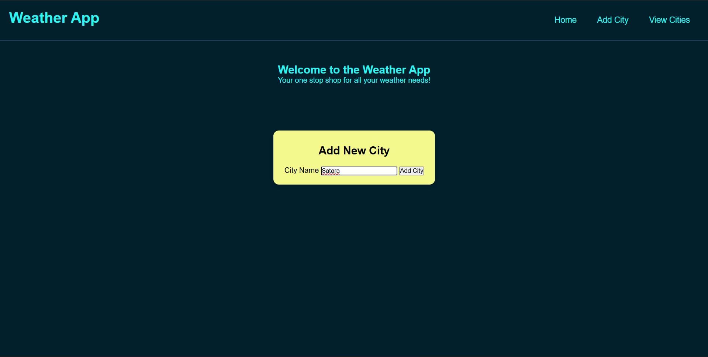
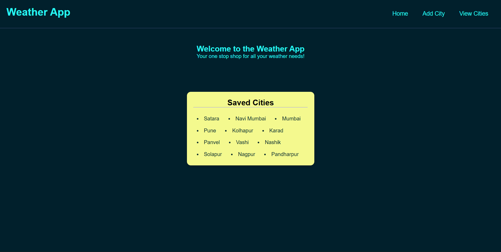
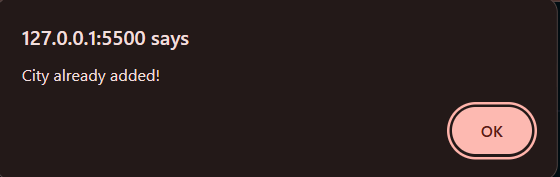

# 🌦️ Weather App

My first Frontend Development project built using **HTML, CSS, and JavaScript**.

This Weather App allows users to search and save cities, view current weather conditions, and check a 7-day weather forecast using the WeatherAPI service.

---

## 🚀 Features

- 📍 View current weather of a city
- 🌡️ Display temperature, humidity, wind speed, and weather condition
- 📅 View 7-day weather forecast
- ➕ Add new cities
- 📋 View saved cities
- 🔄 Click saved cities to load weather information
- 💾 Data persistence using Local Storage
- ⚠️ Duplicate city prevention
- 🎨 Responsive and clean UI

---

## 🛠️ Technologies Used

- HTML5
- CSS3
- JavaScript (ES6)
- WeatherAPI

---

## 📸 Screenshots

### Home Page



### Add City



### View Added Cities



### Duplicate City Alert



---

## 📂 Project Structure

```text
Weather_App/
│
├── index.html
├── style.css
├── script.js
│
├── Screenshots/
│   ├── Home.png
│   ├── Add_City.png
│   ├── View_Added_Cities.png
│   └── Already_Added_City_Alert.png
│
└── README.md
```

---

## ⚙️ How to Run

1. Clone the repository

```bash
git clone <repository-url>
```

2. Open the project folder

```bash
cd Weather_App
```

3. Open `index.html` in your browser

---

## 📚 What I Learned

Through this project I learned:

- HTML page structure
- CSS Flexbox and styling
- JavaScript DOM manipulation
- Event handling
- Fetch API
- Working with external APIs
- Local Storage
- Dynamic content rendering

---

## 🎯 Future Improvements

- Auto-detect current location
- Weather icons
- Responsive mobile design
- Dark/Light theme toggle
- Remove saved cities option
- Search suggestions

---

## 👨‍💻 Author

**Vinayak Kokare**

B.Sc. Computer Science Student  
Aspiring Software Developer

GitHub: https://github.com/your-github-username

---

⭐ If you like this project, feel free to star the repository.
